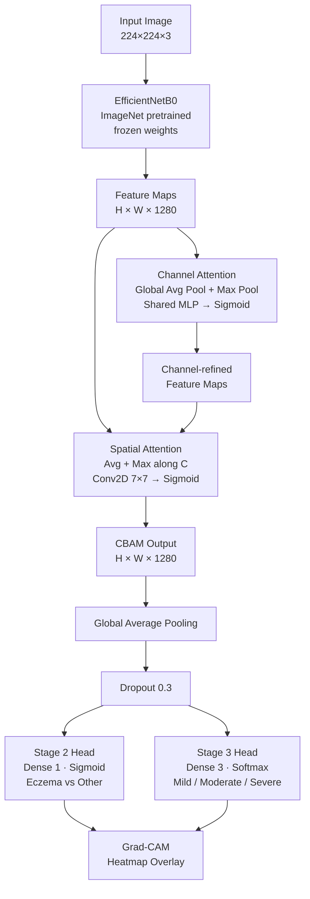

# Attention-Enhanced Eczema Severity Classification

A deep learning pipeline for automated eczema severity classification using
EfficientNetB0 with Convolutional Block Attention Module (CBAM) and Grad-CAM
interpretability, trained on the DermNet skin disease dataset.

---

## Table of Contents

- [Project Overview](#project-overview)
- [Architecture](#architecture)
- [Dataset](#dataset)
- [Setup](#setup)
- [How to Run](#how-to-run)
- [Results](#results)
- [Key Techniques](#key-techniques)
- [File Structure](#file-structure)
- [Requirements](#requirements)
- [License](#license)

---

## Project Overview

Eczema (atopic dermatitis) affects over 200 million people worldwide, yet
clinical severity grading remains subjective and inconsistent across
practitioners. This project builds a two-stage deep learning pipeline that:

1. **Stage 2** — binary classifier distinguishing eczema from other skin
   conditions (balanced negative class, AUC-monitored).
2. **Stage 3** — three-class severity classifier (mild / moderate / severe)
   using manually annotated labels on top of the DermNet eczema images.

**What differentiates this from a vanilla transfer-learning baseline** is the
integration of a **Convolutional Block Attention Module (CBAM)** on top of the
EfficientNetB0 backbone. CBAM applies sequential channel-wise and spatial
attention, allowing the network to suppress irrelevant background regions and
focus on the lesion area. This is complemented by **Grad-CAM visualizations**
that make predictions interpretable — a critical requirement for any
clinically-facing tool.

---

## Architecture



**Training strategy:** The backbone is frozen during initial training. All
three model variants (MobileNetV2, EfficientNetB0, CBAM) follow the same
compile/callback/evaluation protocol to enable fair comparison.

---

## Dataset

**Source:** [DermNet on Kaggle](https://www.kaggle.com/datasets/shubhamgoel27/dermnet)

The dataset is organized into `train/` and `test/` folders by disease class.
This project uses the following subsets:

### Stage 2 — Binary Classification

| Class        | Count  |
|--------------|--------|
| Eczema       | 1,408  |
| Other skin   | 1,408* |

\* Downsampled from four negative folders (Acne & Rosacea, Psoriasis, Seborrheic
Keratoses, Warts & Molluscum) to match eczema count, using `random_state=42`.

### Stage 3 — Severity Classification

| Severity | Count |
|----------|-------|
| Mild     | 393   |
| Moderate | 641   |
| Severe   | 373   |

> **Note:** DermNet does not include severity sub-labels. Stage 3 labels must
> be manually assigned using the template generated by `scripts/make_splits.py`
> (`data/splits/stage3_unlabeled.csv`). Class imbalance is handled via
> `compute_class_weight(strategy="balanced")`.

### Expected directory layout

```
data/raw/dermnet/
├── train/
│   ├── Atopic Dermatitis Photos/
│   ├── Acne and Rosacea Photos/
│   ├── Psoriasis pictures Lichen Planus and related diseases/
│   ├── Seborrheic Keratoses and other Benign Tumors/
│   └── Warts Molluscum and other Viral Infections/
└── test/
    └── (same structure)
```

---

## Setup

### Prerequisites

- Python 3.9+
- GPU recommended (tested with TensorFlow 2.20 + CUDA 11)

### Installation

```bash
# 1. Clone the repository
git clone https://github.com/<your-username>/eczema-severity-classification.git
cd eczema-severity-classification

# 2. Create and activate a virtual environment (recommended)
python -m venv .venv
source .venv/bin/activate        # macOS / Linux
# .venv\Scripts\activate         # Windows

# 3. Install dependencies
pip install -r requirements.txt

# 4. Download DermNet from Kaggle and place it at data/raw/dermnet/
#    (requires kaggle CLI configured with your API key)
kaggle datasets download -d shubhamgoel27/dermnet -p data/raw/
unzip data/raw/dermnet.zip -d data/raw/dermnet/
```

---

## How to Run

### Step 1 — Generate dataset splits

```bash
python scripts/make_splits.py
```

This produces:

| File | Description |
|------|-------------|
| `data/splits/stage2_train.csv` | Stage 2 training split |
| `data/splits/stage2_val.csv`   | Stage 2 validation split |
| `data/splits/stage2_test.csv`  | Stage 2 test split |
| `data/splits/stage3_unlabeled.csv` | Template for severity labels |

> Fill in `mild`, `moderate`, or `severe` in `stage3_unlabeled.csv`, then
> re-run `make_splits.py` (or write a custom splitter) to produce
> `stage3_train.csv` / `stage3_val.csv`.

### Step 2 — Train

```bash
# Stage 2: eczema detection (binary)
python train.py --stage 2 --model cbam

# Stage 3: severity classification (3-class)
python train.py --stage 3 --model cbam

# Other model variants
python train.py --stage 2 --model mobilenetv2 --batch_size 16
python train.py --stage 2 --model efficientnetb0 --epochs 30
```

Checkpoints are saved to `models/`, training logs to `logs/`.

### Step 3 — Grad-CAM evaluation

```bash
# Stage 2
python evaluate.py \
    --model_path models/stage2_cbam_best.h5 \
    --image_path data/raw/dermnet/test/Atopic\ Dermatitis\ Photos/sample.jpg \
    --label_list eczema,other_skin

# Stage 3
python evaluate.py \
    --model_path models/stage3_cbam_best.h5 \
    --image_path path/to/image.jpg \
    --label_list mild,moderate,severe
```

Output heatmaps are saved to `outputs/gradcam_<filename>.png`.

---

## Results

### Stage 2 — Eczema vs. Other Skin

| Model                  | Val Accuracy | Val AUC | Params  |
|------------------------|:------------:|:-------:|---------|
| MobileNetV2            | TBD          | TBD     | ~3.4 M  |
| EfficientNetB0         | TBD          | TBD     | ~5.3 M  |
| EfficientNetB0 + CBAM  | TBD          | TBD     | ~5.3 M+ |

### Stage 3 — Severity Classification (Mild / Moderate / Severe)

| Model                  | Val Accuracy | Macro F1 | Weighted F1 |
|------------------------|:------------:|:--------:|:-----------:|
| MobileNetV2            | TBD          | TBD      | TBD         |
| EfficientNetB0         | TBD          | TBD      | TBD         |
| EfficientNetB0 + CBAM  | TBD          | TBD      | TBD         |

> Full per-class classification reports are saved to `logs/stage{N}_{model}_report.txt`
> after running `train.py`.

---

## Key Techniques

### Transfer Learning
EfficientNetB0 and MobileNetV2 backbones are initialized with ImageNet weights
and frozen during training. Only the classification head (and CBAM layers) are
trained, which stabilizes training on the small DermNet subset.

### CBAM — Convolutional Block Attention Module
CBAM ([Woo et al., 2018](https://arxiv.org/abs/1807.06521)) applies two
sequential attention gates:

- **Channel attention** — learns *which* feature maps to emphasize using
  global average and max pooling fed through a shared MLP.
- **Spatial attention** — learns *where* to focus by convolving a 7×7 kernel
  over channel-pooled feature maps.

Together they help the network suppress skin background and highlight active
lesion regions without requiring pixel-level annotations.

### Grad-CAM
Gradient-weighted Class Activation Mapping ([Selvaraju et al., 2017](https://arxiv.org/abs/1610.02391))
backpropagates gradients from a target class score to the last convolutional
layer, producing a heatmap that explains which image regions drove the
prediction. This is critical for clinical plausibility checking.

### Class Weighting
All stages use `sklearn.utils.class_weight.compute_class_weight(strategy="balanced")`
to handle class imbalance without oversampling, passing the resulting weight
dict directly to `model.fit(class_weight=...)`.

---

## File Structure

```
eczema-severity-classification/
│
├── data/
│   ├── raw/dermnet/           # DermNet images (not committed)
│   └── splits/                # Generated train/val/test CSVs
│
├── logs/                      # Training history CSVs + classification reports
├── models/                    # Saved model checkpoints (.h5)
├── outputs/                   # Grad-CAM overlay images
│
├── scripts/
│   └── make_splits.py         # Dataset preparation and split generation
│
├── src/
│   ├── dataset.py             # tf.data pipeline, class weights, label utils
│   ├── models.py              # Model definitions (MobileNetV2, EfficientNetB0, CBAM)
│   ├── train_utils.py         # Training helper utilities
│   ├── eval_utils.py          # Evaluation helper utilities
│   ├── gradcam_utils.py       # Batch Grad-CAM utilities
│   └── data_utils.py          # Miscellaneous data utilities
│
├── train.py                   # Main training entry point
├── evaluate.py                # Grad-CAM visualization entry point
├── requirements.txt
└── README.md
```

---

## Requirements

Core dependencies (pinned versions in `requirements.txt`):

| Package        | Version  | Purpose                        |
|----------------|----------|--------------------------------|
| tensorflow     | 2.20.0   | Model building and training    |
| keras          | 3.10.0   | High-level model API           |
| scikit-learn   | 1.6.1    | Class weights, metrics         |
| pandas         | 2.3.3    | CSV split management           |
| numpy          | 2.0.2    | Numerical operations           |
| matplotlib     | 3.9.4    | Grad-CAM visualization         |
| pillow         | 11.3.0   | Image I/O                      |

Install all dependencies with:

```bash
pip install -r requirements.txt
```

---

## License

This project is licensed under the **MIT License**.

```
MIT License

Copyright (c) 2024 Gunnabhiram

Permission is hereby granted, free of charge, to any person obtaining a copy
of this software and associated documentation files (the "Software"), to deal
in the Software without restriction, including without limitation the rights
to use, copy, modify, merge, publish, distribute, sublicense, and/or sell
copies of the Software, and to permit persons to whom the Software is
furnished to do so, subject to the following conditions:

The above copyright notice and this permission notice shall be included in all
copies or substantial portions of the Software.

THE SOFTWARE IS PROVIDED "AS IS", WITHOUT WARRANTY OF ANY KIND, EXPRESS OR
IMPLIED, INCLUDING BUT NOT LIMITED TO THE WARRANTIES OF MERCHANTABILITY,
FITNESS FOR A PARTICULAR PURPOSE AND NONINFRINGEMENT. IN NO EVENT SHALL THE
AUTHORS OR COPYRIGHT HOLDERS BE LIABLE FOR ANY CLAIM, DAMAGES OR OTHER
LIABILITY, WHETHER IN AN ACTION OF CONTRACT, TORT OR OTHERWISE, ARISING FROM,
OUT OF OR IN CONNECTION WITH THE SOFTWARE OR THE USE OR OTHER DEALINGS IN THE
SOFTWARE.
```

---

> This project was developed as part of a university deep learning course.
> DermNet dataset courtesy of [Shubham Goel on Kaggle](https://www.kaggle.com/datasets/shubhamgoel27/dermnet).
> CBAM attention mechanism based on Woo et al. (ECCV 2018).
> Grad-CAM based on Selvaraju et al. (ICCV 2017).
