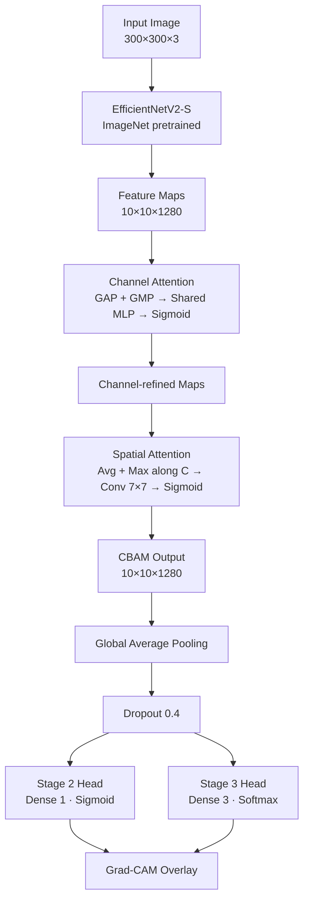

# Attention-Enhanced Eczema Severity Classification

A deep learning pipeline for eczema detection and severity grading using
EfficientNet backbones (B0 / V2-S) with a Convolutional Block Attention
Module (CBAM) and Grad-CAM interpretability, trained on the DermNet skin
disease dataset.

---

## Table of Contents

- [Project Overview](#project-overview)
- [Architecture](#architecture)
- [Dataset](#dataset)
- [Setup](#setup)
- [How to Run](#how-to-run)
- [Results](#results)
- [Key Techniques](#key-techniques)
- [File Structure](#file-structure)
- [Requirements](#requirements)
- [License](#license)

---

## Project Overview

Eczema (atopic dermatitis) affects over 200 million people worldwide, yet
clinical severity grading remains subjective and inconsistent across
practitioners. This project builds a three-stage pipeline:

1. **Stage 1** — skin vs. not-skin (gatekeeper to reject non-dermatological
   inputs; uses CIFAR-10 non-skin classes as negatives).
2. **Stage 2** — eczema vs. other skin conditions (binary, balanced 2,156 per
   class; negatives include psoriasis, acne, seborrheic keratoses, warts).
3. **Stage 3** — three-class severity (mild / moderate / severe), labeled
   from filename keywords on DermNet eczema images.

EfficientNet backbones are paired with a **Convolutional Block Attention
Module (CBAM)** that applies sequential channel and spatial attention so the
network focuses on lesion regions rather than background skin. **Grad-CAM**
overlays are generated at inference time to verify where the model is
actually looking — a requirement for any clinically-facing tool.

---

## Architecture



**Training strategy** — two-phase fine-tuning:

1. **Warmup**: backbone frozen, head + CBAM only, LR 1e-3.
2. **Fine-tune**: unfreeze top-N backbone layers (BatchNorm stays frozen),
   cosine-decay LR from 1e-4, AdamW weight decay.

Available backbones: `mobilenetv2`, `efficientnetb0`, `efficientnetv2s`,
`cbam` (EfficientNetB0 + CBAM), `cbam_v2s` (EfficientNetV2-S + CBAM).

---

## Dataset

**Source:** [DermNet on Kaggle](https://www.kaggle.com/datasets/shubhamgoel27/dermnet)

Splits are generated by `scripts/make_splits.py` into `data/splits/`:
`{stage1,stage2,stage3}_{train,val,test}.csv` (stratified 80 / 10 / 10 for
stages 1–2, 70 / 15 / 15 for stage 3).

### Stage 1 — Skin vs. Not-Skin

| Class    | Count |
|----------|------:|
| skin     | 3,000 |
| not_skin | 3,000 |

`not_skin` is generated once from CIFAR-10 classes 0–7 (airplane, automobile,
bird, cat, deer, dog, frog, horse) into `data/raw/not_skin/`.

### Stage 2 — Eczema vs. Other Skin (balanced)

| Class      | Count |
|------------|------:|
| eczema     | 2,156 |
| other_skin | 2,156 |

Positive: `Atopic Dermatitis Photos` + `Eczema Photos` (train + test).
Negative: 4 disease folders (Acne & Rosacea, Psoriasis, Seborrheic Keratoses,
Warts & Molluscum), downsampled to match eczema count.

### Stage 3 — Severity (mild / moderate / severe)

| Severity | Count |
|----------|------:|
| moderate | 991   |
| severe   | 455   |
| mild     | 77    |
| **Total**| **1,523** |

Labels are derived from filename keywords in `Eczema Photos` (see
`SEVERITY_MAP` in `scripts/make_splits.py`). The map covers 48 keywords
spanning clinical presentations: e.g. `*chronic*` / `*trunk-generalized*` →
severe, `*nummular*` / `*hand*` / `*fingertip*` → moderate, `*acute*` /
`*face*` / `*factitial*` → mild. Only 21 of 1,544 images remain unlabeled.
Focal loss (`--focal_gamma 2.0`) and oversampling (`--balance`) are used at
training time to address the residual class imbalance.

### Expected directory layout

```
data/raw/
├── dermnet/
│   ├── train/
│   │   ├── Atopic Dermatitis Photos/
│   │   ├── Eczema Photos/
│   │   ├── Acne and Rosacea Photos/
│   │   ├── Psoriasis pictures Lichen Planus and related diseases/
│   │   ├── Seborrheic Keratoses and other Benign Tumors/
│   │   └── Warts Molluscum and other Viral Infections/
│   └── test/                  # same structure
└── not_skin/                  # auto-generated from CIFAR-10 on first run
```

---

## Setup

```bash
git clone https://github.com/<your-username>/eczema-severity-classification.git
cd eczema-severity-classification

python -m venv .venv
source .venv/bin/activate        # macOS / Linux
# .venv\Scripts\activate         # Windows

pip install -r requirements.txt

# Download DermNet via Kaggle CLI (requires configured API key)
kaggle datasets download -d shubhamgoel27/dermnet -p data/raw/
unzip data/raw/dermnet.zip -d data/raw/dermnet/
```

Tested on Python 3.9+, TensorFlow 2.20 (CUDA 11 on Linux/Windows, Apple
Metal on macOS).

---

## How to Run

### Step 1 — Generate splits

```bash
python scripts/make_splits.py
```

Produces `data/splits/stage{1,2,3}_{train,val,test}.csv`. Re-run any time
the raw data or the `SEVERITY_MAP` keyword rules change.

### Step 2 — Train

**Stage 2 — eczema detection (binary)**

```bash
python train.py --stage 2 --model cbam_v2s --image_size 300 --batch_size 16 \
    --epochs 50 --warmup_epochs 10 --unfreeze_at 80
```

**Stage 3 — severity classification (3-class, imbalanced → use `--balance` + focal loss)**

```bash
python train.py --stage 3 --model cbam_v2s --image_size 300 --batch_size 16 \
    --epochs 80 --warmup_epochs 15 --unfreeze_at 60 \
    --mixup 0.3 --focal_gamma 2.0 --balance --dropout 0.5 --label_smoothing 0.05
```

**Evaluate an existing checkpoint (no retraining)**

```bash
python train.py --stage 2 --model cbam_v2s --image_size 300 --batch_size 16 --eval_only
```

**Lighter / faster alternatives**

```bash
python train.py --stage 2 --model mobilenetv2    --batch_size 32
python train.py --stage 2 --model efficientnetb0 --batch_size 32
```

Checkpoints land in `models/{stage}_{model}_best.keras`, training history
in `logs/*.csv`, per-class classification reports in `logs/*_report.txt`.

### Step 3 — Grad-CAM evaluation

```bash
python evaluate.py \
    --model_path models/stage2_cbam_v2s_best.keras \
    --image_path "data/raw/dermnet/train/Atopic Dermatitis Photos/<sample>.jpg" \
    --label_list eczema,other_skin \
    --image_size 300 300

python evaluate.py \
    --model_path models/stage3_cbam_v2s_best.keras \
    --image_path "data/raw/dermnet/train/Eczema Photos/<sample>.jpg" \
    --label_list mild,moderate,severe \
    --image_size 300 300
```

Output: `outputs/gradcam_<filename>.png`.

### CLI reference

| Flag | Default | Purpose |
|------|---------|---------|
| `--stage` | — | `2` (binary) or `3` (severity) |
| `--model` | — | Backbone: `mobilenetv2`, `efficientnetb0`, `efficientnetv2s`, `cbam`, `cbam_v2s` |
| `--image_size` | 224 | Input spatial size (use 300 for V2-S) |
| `--batch_size` | 32 | Per-step batch size |
| `--epochs` | 50 | Total epochs (warmup + fine-tune) |
| `--warmup_epochs` | 10 | Frozen-backbone epochs |
| `--unfreeze_at` | 60 | Top-N backbone layers to unfreeze for fine-tune |
| `--warmup_lr` | 1e-3 | LR during warmup |
| `--finetune_lr` | 1e-4 | Initial LR for cosine decay |
| `--weight_decay` | 1e-4 | AdamW weight decay |
| `--dropout` | 0.4 | Head dropout |
| `--label_smoothing` | 0.1 | Soft-label factor |
| `--mixup` | 0.0 | MixUp alpha (0 disables) |
| `--focal_gamma` | 0.0 | Focal loss γ for stage 3 (0 = standard CE; recommended: 2.0) |
| `--balance` | off | Oversample minority classes to match majority |
| `--no_tta` | off | Disable 4-way flip TTA at eval |
| `--eval_only` | off | Load best checkpoint and run eval only |

---

## Results

All numbers are from the validation set. Stage 2 uses `image_size=300`; Stage 3 uses `image_size=300` with `--balance --mixup 0.3 --focal_gamma 2.0`.

### Stage 2 — Eczema vs. Other Skin (431 val samples)

| Model | Val Accuracy | Macro F1 | Notes |
|---|---:|---:|---|
| MobileNetV2 | 0.852 | 0.851 | Baseline |
| CBAM + EfficientNetB0 | 0.845 | 0.845 | |
| **CBAM + EfficientNetV2S** | **0.870** | **0.870** | Best — threshold 0.480 |

Per-class breakdown for best model (CBAM + EfficientNetV2S):

| Class | Precision | Recall | F1 | Support |
|---|---:|---:|---:|---:|
| eczema | 0.854 | 0.894 | 0.873 | 216 |
| other_skin | 0.888 | 0.847 | 0.867 | 215 |

### Stage 3 — Severity Grading (mild / moderate / severe)

| Model | Val Samples | Val Accuracy | Macro F1 | Weighted F1 |
|---|---:|---:|---:|---:|
| CBAM + EfficientNetB0 (baseline) | 31 | 0.774 | 0.484 | 0.738 |
| **CBAM + EfficientNetV2S** (focal loss + expanded data) | **228** | **0.798** | **0.748** | **0.799** |

Per-class breakdown for best model (CBAM + EfficientNetV2S):

| Class | Precision | Recall | F1 | Support |
|---|---:|---:|---:|---:|
| mild | 0.727 | 0.667 | 0.696 | 12 |
| moderate | 0.863 | 0.851 | 0.857 | 148 |
| severe | 0.676 | 0.706 | 0.691 | 68 |

**Improvements over baseline:** expanded severity map recovered 585 previously skipped images (938 → 1,523 total labeled), raising mild train samples from 31 → 54. Focal loss (γ=2) lifted mild F1 from 0.40 → 0.70 and macro F1 from 0.484 → 0.748.

---

## Key Techniques

### Transfer Learning with Two-Phase Fine-Tuning
Backbones initialized from ImageNet. Phase 1 trains the head + CBAM with the
backbone frozen; Phase 2 unfreezes the top-N layers (BatchNorm kept frozen)
and fine-tunes with a cosine-decayed AdamW optimizer.

### CBAM — Convolutional Block Attention Module
CBAM ([Woo et al., 2018](https://arxiv.org/abs/1807.06521)) applies channel
attention (global avg + max pool → shared MLP → sigmoid) followed by spatial
attention (channel avg + max → Conv 7×7 → sigmoid), letting the network
suppress irrelevant background and emphasize lesion regions.

### MixUp
Pair-wise linear interpolation of images and labels drawn from
Beta(α, α), sampled via Gamma. Stabilizes training on small/imbalanced
subsets and acts as implicit label smoothing.

### Focal Loss (`--focal_gamma`)
Categorical focal loss ([Lin et al., 2017](https://arxiv.org/abs/1708.02002))
scales the per-sample cross-entropy by `(1 − p_t)^γ`, where `p_t` is the
model's confidence in the correct class. Easy examples (high `p_t`) contribute
less to the gradient, so training focuses on the hard minority class. γ=2.0
is used for Stage 3.

### Class Balancing via Oversampling (`--balance`)
For imbalanced splits (stage 3), minority classes are sampled with
replacement up to the majority count, so each class contributes equally to
the loss per epoch.

### Test-Time Augmentation (TTA)
At eval time, predictions are averaged over four flip variants (original,
hflip, vflip, hflip+vflip). Disable with `--no_tta`.

### Threshold Sweep (Stage 2)
Binary stage sweeps decision thresholds in [0.1, 0.9] on the validation set
and picks the one that maximizes macro-F1 — avoids locking to the default
0.5 when AUC is high but the raw probabilities are biased.

### Augmentation
Random horizontal flip, ±15° rotation, ±10% translation, ±15% zoom,
brightness / contrast / saturation / hue jitter. Preprocessing
(Rescaling / normalization) is handled inside the model so pixel values
flow through the pipeline in [0, 255].

### Grad-CAM
Gradient-weighted Class Activation Mapping
([Selvaraju et al., 2017](https://arxiv.org/abs/1610.02391)) backpropagates
class-score gradients to the last Conv2D, yielding a heatmap that explains
which regions drove the prediction.

---

## File Structure

```
eczema-severity-classification/
│
├── data/
│   ├── raw/dermnet/           # DermNet images (not committed)
│   ├── raw/not_skin/          # Auto-generated CIFAR-10 non-skin images
│   └── splits/                # Generated train/val/test CSVs
│
├── logs/                      # Training history CSVs + classification reports
├── models/                    # Saved model checkpoints (.keras)
├── outputs/                   # Grad-CAM overlay images
│
├── scripts/
│   └── make_splits.py         # Split generator (stages 1, 2, 3)
│
├── src/
│   ├── dataset.py             # tf.data pipeline, MixUp, oversampling, augmentation
│   ├── models.py              # Backbones + CBAM, freeze/unfreeze helpers
│   ├── losses.py              # Focal loss implementation
│   └── gradcam_utils.py       # Batch Grad-CAM utilities
│
├── train.py                   # Training + evaluation entry point
├── evaluate.py                # Grad-CAM visualization entry point
├── showcase_results.py        # Results dashboard (training curves, comparison, Grad-CAM)
├── requirements.txt
└── README.md
```

---

## Requirements

| Package      | Version  | Purpose                     |
|--------------|----------|-----------------------------|
| tensorflow   | 2.20.0   | Model building and training |
| keras        | 3.10.0   | High-level model API        |
| scikit-learn | 1.6.1    | Class weights, metrics      |
| pandas       | 2.3.3    | CSV split management        |
| numpy        | 2.0.2    | Numerical operations        |
| matplotlib   | 3.9.4    | Grad-CAM visualization      |
| pillow       | 11.3.0   | Image I/O                   |

```bash
pip install -r requirements.txt
```

---

## License

This project is licensed under the **MIT License**.

```
MIT License

Copyright (c) 2024 Gunnabhiram

Permission is hereby granted, free of charge, to any person obtaining a copy
of this software and associated documentation files (the "Software"), to deal
in the Software without restriction, including without limitation the rights
to use, copy, modify, merge, publish, distribute, sublicense, and/or sell
copies of the Software, and to permit persons to whom the Software is
furnished to do so, subject to the following conditions:

The above copyright notice and this permission notice shall be included in all
copies or substantial portions of the Software.

THE SOFTWARE IS PROVIDED "AS IS", WITHOUT WARRANTY OF ANY KIND, EXPRESS OR
IMPLIED, INCLUDING BUT NOT LIMITED TO THE WARRANTIES OF MERCHANTABILITY,
FITNESS FOR A PARTICULAR PURPOSE AND NONINFRINGEMENT. IN NO EVENT SHALL THE
AUTHORS OR COPYRIGHT HOLDERS BE LIABLE FOR ANY CLAIM, DAMAGES OR OTHER
LIABILITY, WHETHER IN AN ACTION OF CONTRACT, TORT OR OTHERWISE, ARISING FROM,
OUT OF OR IN CONNECTION WITH THE SOFTWARE OR THE USE OR OTHER DEALINGS IN THE
SOFTWARE.
```

---

> Developed as part of a university deep learning course.
> DermNet dataset courtesy of [Shubham Goel on Kaggle](https://www.kaggle.com/datasets/shubhamgoel27/dermnet).
> CBAM based on Woo et al. (ECCV 2018). Grad-CAM based on Selvaraju et al. (ICCV 2017).
